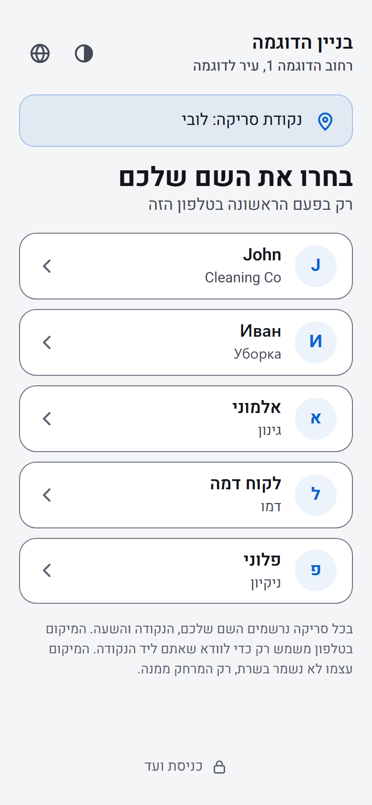
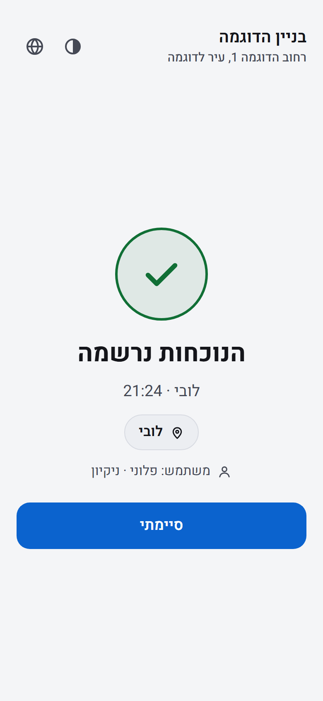
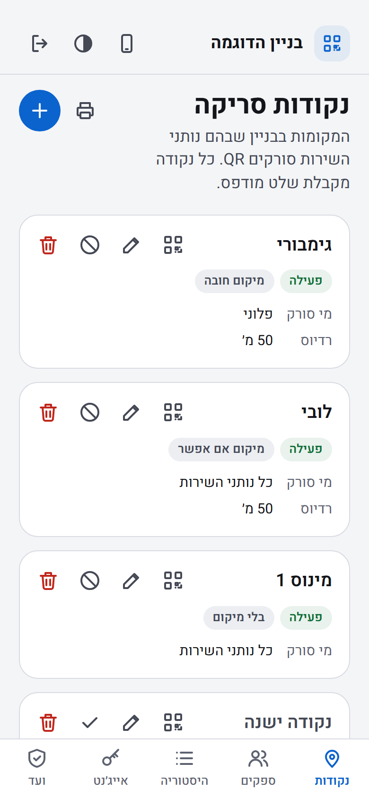
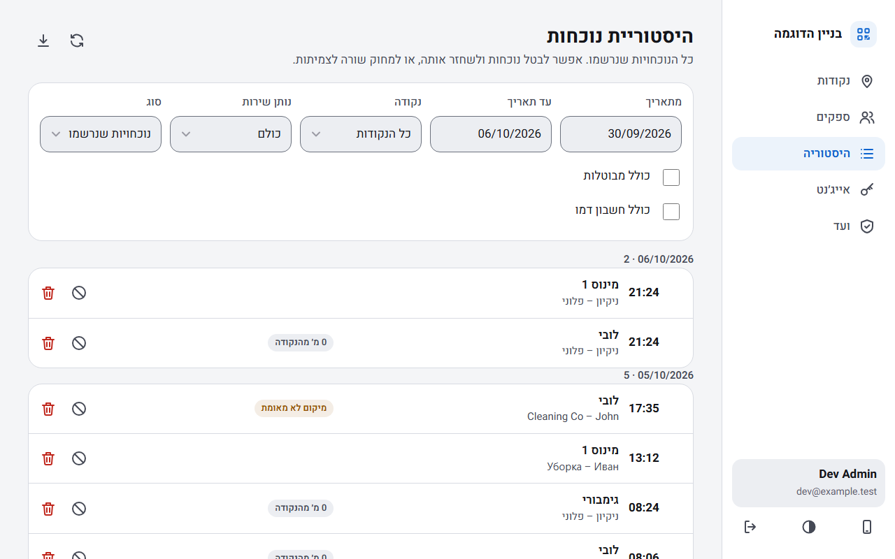

# Building attendance with QR

Service providers (a cleaning company, a gardener) check in by scanning a QR sign in the building with their phone. The
building committee sees who came, where and when, and the committee's own AI agent can read the same data. The app
records facts and analyses nothing.

It is free and open source (MIT). Any building committee can install its own copy: **[install guide](docs/install.md)**.

| Provider app: pick your name (first time on a phone) | Provider app: the check-in is recorded | Committee app on a phone: the points |
|:---:|:---:|:---:|
|  |  |  |

  
   
  <em>Committee app on a computer: the history of visits.</em>

The committee app is in Hebrew. Every screen above shows invented sample data. More pictures are in
[docs/screenshots](docs/screenshots/README.md).

## How it works

1. **The committee** adds points in the building (the lobby, the garage) and prints a QR sign for each one.
2. **The service provider** scans the sign with the phone camera. The first time on a phone they choose their name and
   enter a personal password. After that every scan is one tap.
3. **The visit is stored** as one row in the database: who, where and when. The committee reads it in the committee app,
   and the committee's AI agent reads it through a read-only API.

## What you get

- **A provider app in four languages:** Hebrew, English, Russian and Arabic. It installs to the Home Screen and works
  without a signal: visits wait in a queue on the phone and upload by themselves.
- **A committee app** at `/admin`: points and their printable QR signs, service providers (and the health of each
  provider's phones), history (and the visits that were not counted), agent keys, the committee and its audit log, and a
  help page. The committee names the building, and both apps show the name. Sign-in is with Google, only for people on
  the committee list.
- **A location check ("soft GPS").** A scan is refused only when the phone has an accurate position that is clearly far
  from the point. With no signal or a weak position the visit is recorded and flagged `location_unverified`, except at a
  point set to `required`, where a scan without a position is refused. Each point is `required`, `optional` or `none`
  (for a basement).
- **A read-only API for the committee's own AI agent:** [docs/agent-api.md](docs/agent-api.md), with a ready-made prompt
  in [docs/agent-prompt.md](docs/agent-prompt.md).
- **Daily jobs.** One deletes personal data when its retention period ends. One sends a short health summary, if you set
  that up.
- **A smoke test after every deploy** that checks the live site and opens an issue if it is broken.
- **Releases with notes for installers:** what changed, and what you must do when you update.

## What it needs, and the limits

You need free accounts at **GitHub** (your copy of the code), **Vercel** (hosting), **Neon** (the Postgres database) and
**Google** (a Google Cloud project, for the committee's sign-in). You also need one technical volunteer, who knows
their way around GitHub, a terminal and web consoles. They do not need to be a developer. Every service has a free plan
that this app fits on. Plans change, so check each one's current limits.

- **The committee app is in Hebrew only** for now. Its translation is planned. The provider app has four languages.
- **The building must be in Israel.** The time zone is fixed in the code, and dates are always DD/MM/YYYY.
- **One building per installation.** A second building is a second installation.
- **Only a public copy is supported:** a public fork of this repository.
- **Vercel's Hobby plan is for non-commercial use.** Check that your committee fits its fair use guidelines. If it does
  not, the paid plan is the answer.
- **The address is printed in every QR code.** Choose it before you print a sign.

The details are in [section 1 of the install guide](docs/install.md#1-what-you-get-and-the-limits).

## Install your own copy

**[docs/install.md](docs/install.md)** takes you from nothing to a working installation for one building: your own
fork of this repository, a Vercel project, a Neon database, Google sign-in, the first committee member, and a first test
scan. The deploy is done in the web consoles, and a few GitHub settings use the GitHub CLI. If something breaks later,
start with [docs/runbooks/something-broke.md](docs/runbooks/something-broke.md).

**Keeping a copy up to date.** A copy updates by releases, and every release has notes that say what changed and what an
installer must do ([docs/releases.md](docs/releases.md)). A security fix is released the same day it merges, so watch the
releases. The steps are in [section 5 of the install guide](docs/install.md#5-updating-a-copy).

**Which version is a phone running?** Both apps show their build id, the first 7 characters of the commit that Vercel
built (`dev` for a local build). It is at the foot of the home screen in the provider app, and at the foot of the
Committee tab ("ועד") in the committee app. The server's own commit is the `commit` of `GET /api/health`, so a phone that
shows another id than the server is running an older app.

## How it is built

A Vite and React app (a PWA), one Vercel serverless function, and a Neon Postgres database.

| Part | What |
|---|---|
| Provider app | `/` and `/scan?code=...`. Four languages, and it works without a signal (a local queue on the phone that uploads by itself). Code in `src/worker`, `src/i18n`, `src/pages/WorkerApp.jsx` |
| Committee app | `/admin`, in Hebrew only for now. Sign-in only with a Google account that is on the committee list. Code in `src/admin`, `src/pages/AdminApp.jsx` |
| API | One Vercel function (`api/index.js`, to which `vercel.json` routes every `/api/*`) that runs `server/`. Postgres through `pg`. The router checks who may call a route before any code of its handler runs: a route is protected by default, and only the `PUBLIC` list in `server/access.js` answers without credentials |
| Database | `db/migrations/*.sql`. Scans are append-only: they can only be voided, and a single row can be deleted only from the committee screen. A point, a service provider, a committee member or an agent key can be deleted, and their history stays with the name that was recorded |

The folders are described in [CONTRIBUTING.md](CONTRIBUTING.md#structure), and the reasons behind the main decisions are in
[docs/adr/](docs/adr/README.md).

## Privacy and security

- **Privacy:** [docs/privacy.md](docs/privacy.md) says what personal data the app keeps, for how long, and who can see it.
- **Security:** report a problem privately, never in a public issue. See [SECURITY.md](SECURITY.md).

## Contributing

A bug, an idea or code: see [CONTRIBUTING.md](CONTRIBUTING.md), which also explains how to run the project on your own
computer and how a pull request is checked. Please write in English.

**Coding agents** (Claude Code, Codex, any other) work by [AGENTS.md](AGENTS.md). It is the single source of instructions
for this repository.

## License and code of conduct

The project is open under the MIT license ([LICENSE](LICENSE)). By taking part you agree to follow the
[Code of Conduct](CODE_OF_CONDUCT.md).

## History

The project replaced an older Firebase app on 01/10/2026. What is left of that move, and the redirect site for the QR
codes that were already printed, is in [legacy-redirect/README.md](legacy-redirect/README.md). A new installation does not
use any of it.
